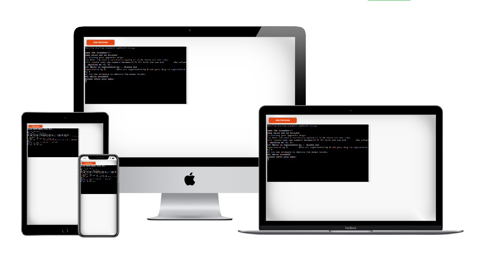
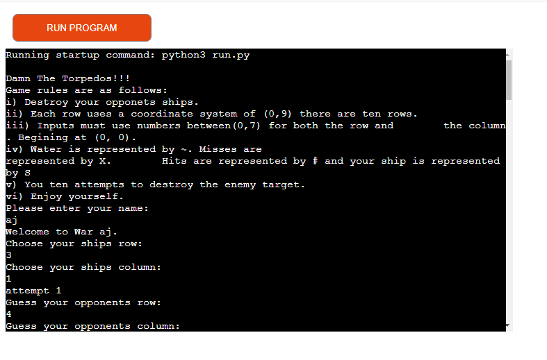
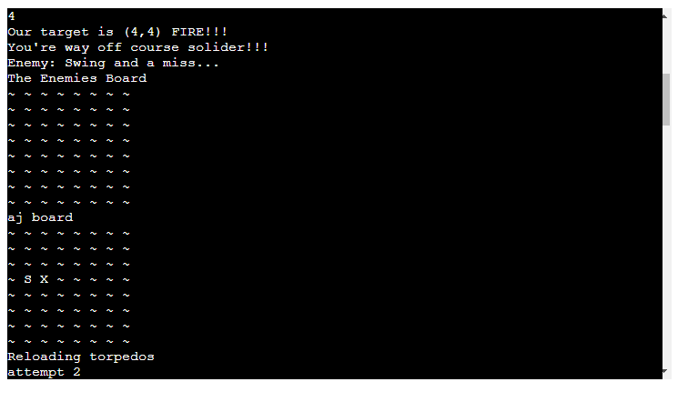
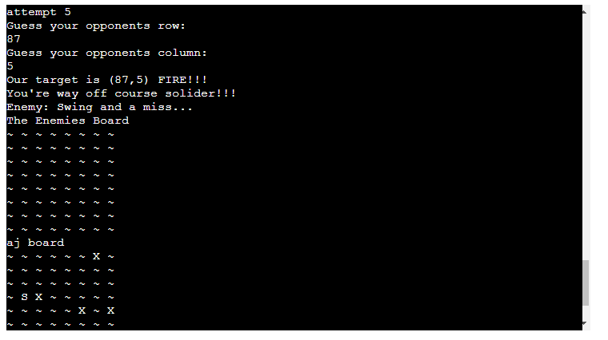
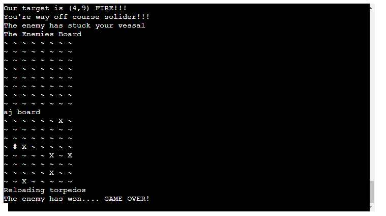
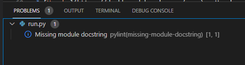
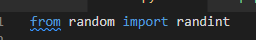

# Angus Friel

## Project-Name: Damn the Torpedoes

[View Deployed Site Here](https://damn-the-torpedos.herokuapp.com/)

## Features
The game starts by displaying the rules for the player and then asks the players name. The game then displays a welcome message for the player. One thing I found difficult was the displaying of the game rules. I tried to split them over two lines to stay within pythons needs for pep8 compliance but, as a result they do not display as I wanted on the game playing screen.

After this, the game askes the player to guess and row and column of the computers ship to fire a torpedo at that location. Once the torpedo has been fired the board is updated to display if the torpedo was a miss or a hit.

Once all attempts have been taken or if the player or the computer hits all the enemies ships the game is then over

### Game Rules
The rules of the game are displayed at the start of the game. They are the following: 

Damn The torpedos!!!
Game rules are as follows:

    i) Destroy your enemies’ ships.
    ii) Each row uses a coordinate system of (0,9) there are ten rows.
    iii) Inputs must use numbers between (0,7) for both the row and the column. Beginning at (0, 0).
    iv) Water is represented by ~. Misses are represented by X. Hits are represented by # and your ship is represented by S.
    v) You ten attempts to destroy the enemy target.
    vi) Enjoy yourself.

## Testing
During testing I ran into some problems with entering a letter or blank space. This took some time to overcome. By using isdigit to check to see if the user has entered a digit along with checking to see if the user has entered the correct coordinates within the boards range, this was the goal of this error handling. I also incorporated a print statement to tell the user that they have entered the wrong details. Weather it was not a digit or if a ship was of course of the board, or if there was already a ship in that location. Then once they have entered the correct details a success message was displayed with the number of turns, they must enter all 8 ships. 

Below is a copy of the code I used for this error handling:

## Bugs
 There was a lot of bugs in this program that took me a while to overcome. But once I had them sorted by eliminating them one by one in terminal window in GitPod, I had zero issues in Pep8 online checker. 
 Below is a list of some of the issues I was encountering. The main problem I had was name convention for global variables and variables within a function. Trying to pass this information from one to the other to update the computers and player’s board. But I overcame this by creating a function that once it completed it then later passes this information back to the global variable. 

Sadly, there is one bug I cannot get rid of. But it does not show up in Pep8 only in the terminal of GitPod.

## Technologies used
The technologies used for the construction of this site are as follows: 
* [Python](https://en.wikipedia.org/wiki/Python_(programming_language)) - The game itself is written in python and held in the run.py file
* [Heroku](https://dashboard.heroku.com/apps) - Heroku was used to deploy the website as python is a backend language and the game needed a terminal to display the game
* [GitPod](gitpod.io) - This was used as an IDE, or the Integrated Development Area, where the HTML, CSS and JavaScript where all written in the required file types in order to display the website. 
* [GitHub](https://github.com/) - this was used to host the website, so it is viewable to the public.

## Deployment

This website was constructed in GitPod and deployed using Github and Heroku. The steps taken to deploy this website from its [GitHub Repository](https://github.com/Ajfriel86/DamnTheTorpedoes) are as follows: 

* Log into GitHub
* Go to the list of repositories on the left-hand side of the screen.
* Click on the repository - Ajfriel86/DamnTheTorpedoes
* Choose the settings tab from the menu items across the top of the page; it is the ninth choice and last option on the menu items.
* Once the settings page has loaded scroll down to GitHub Pages.
* In the source section, choose the master branch.
* On selecting this the page is automatically refreshed and the website is deployed.
* A link to the website is then displayed, this is the deployed websites website address.   

The steps taken to deploy this via Heroku are as follows:
* Create an account on Heroku or login to your previously made account.
* Add a new app.
* Add the python build pack firstly, then add the Nodejs build pack.
* I decided to use an automatic update with my application and proceeded with Manuel to create the environment it displays on.
* After this the application is Tested to see if it works

## Credits
### Content
The content of this website was written by Angus Friel. 

### Code
 The code in this project was constructed by me. It is a combination of what I have learned here at The Code Institute, from previous course, studying for my MTA: Introduction to programming using Python, and from my job at SAP. The inspiration for the game was taken from project example idea 2 - build a battleship game. 

### Acknowledgements

A tutorial that guided me through of build for this game:
[Python Battleships](https://coderspacket.com/battleship-game-in-python)

After this tutorial I incorporated my own way of constructing the finished product. I also had help from my mentor, Brian Macharia. As well as tutor support via the code institute. Everyone involved help me overcome obstacles throughout this project and I am very grateful for their time and help. 

#### Disclaimer
The content of this Website is for educational purposes only.